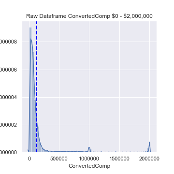
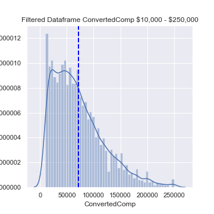
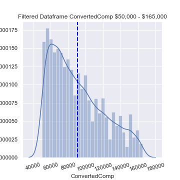
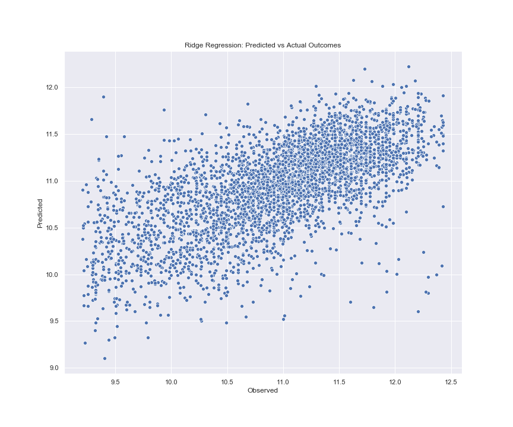
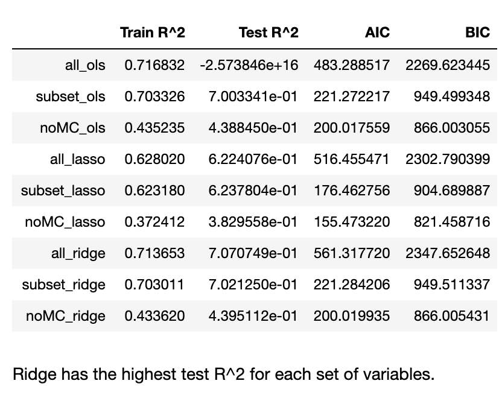

# mod4_project

## The Goal: Predicting Salary Based on Demographics and Developer Experience

For this project, we used multiple linear regression to predict salary based on responses from the 2019 StackOverflow Developer Survey. With our model, we were able to explain about 40% of the variance in respondents' reported salary. Our model was especially effective in predicting salaries between $50,000 and $165,000. Outside of those values, the residual errors in our model were not normally distributed, indicating that further research is needed to make the model suffeciently predictive for all respondents. 

  

## Predictors

The variables that informed our prediction included respondents' demographics, education, social preferences, work experience, and career satisfaction. We combined some of these feature in order to examine the effects of interaction between them. For example, we created interaction variables for gender and ethnicity to see if the combination of those two factors had an effect on salary. After fitting our multiple linear regression using 80% of the data, we eliminated variables with coeffecient p-values above .05 and Variance Influence Factors above 5. 
- **Respondent**: Randomized respondent ID number (not in order of survey response time)
- **ConvertedComp**: Salary converted to annual USD salaries using the exchange rate on 2019-02-01, assuming 12 working months and 50 working weeks.
- **WorkWeekHrs** On average, how many hours per week do you work?
- **YearsCode**: Including any education, how many years have you been coding?
- **Age**: What is your age (in years)? If you prefer not to answer, you may leave this question blank.
- **OrgSize**: Approximately how many people are employed by the company or organization you work for?
- **Gender**: Which of the following do you currently identify as? Please select all that apply. If you prefer not to answer, you may leave this question blank.
- **Ethnicity**: Which of the following do you identify as? Please check all that apply. If you prefer not to answer, you may leave this question blank.
- **LanguageWorkedWith**: Which of the following programming, scripting, and markup languages have you done extensive development work in over the past year, and which do you want to work in over the next year?  (If you both worked with the language and want to continue to do so, please check both boxes in that row.)
- **Country**: In which country do you currently reside?
- **Extraversion**: Do you prefer online chat or IRL conversations?
- **Dependents**: Do you have any dependents (e.g., children, elders, or others) that you care for?
- **Trans**: Do you identify as transgender?
- **EdLevel**: Which of the following best describes the highest level of formal education that you've completed?
- **Student**: Are you currently enrolled in a formal, degree-granting college or university program?
- **MainBranch**: Which of the following options best describes you today? Here, by "developer" we mean "someone who writes code."
- **WorkLoc**: Where would you prefer to work?
- **WorkPlan**: How structured or planned is your work?
- **ImpSyn**: For the specific work you do, and the years of experience you have, how do you rate your own level of competence?
- **Employment**: Which of the following best describes your current employment status?
- **CodeRevHrs**: On average, how many hours per week do you spend on code review?
- **OpSys**: What is the primary operating system in which you work?
- **BetterLife**: Do you think people born today will have a better life than their parents?
- **ResumeUpdate**: Think back to the last time you updated your resumé, CV, or an online profile on a job site. What is the PRIMARY reason that you did so?
- **YearsCodePro**: How many years have you coded professionally (as a part of your work)?
- **LastHireDate**: When was the last time that you took a job with a new employer?
- **JobSat**: How satisfied are you with your current job? (If you work multiple jobs, answer for the one you spend the most hours on.)
- **CareerSat**: Overall, how satisfied are you with your career thus far?
- **JobSeek**: Which of the following best describes your current job-seeking status?
- **Hobbyist**: Do you code as a hobby?
- **CompFreq**: Is that compensation weekly, monthly, or yearly?
- **SOVisitFreq**: How frequently would you say you visit Stack Overflow?
- **SOPartFreq**: How frequently would you say you participate in Q&A on Stack Overflow? By participate we mean ask, answer, vote for, or comment on questions.
- **FizzBuzz**: Have you ever been asked to solve FizzBuzz in an interview?

## The Response

For our model, we considered any respondents that earned between $10,000 and $250,000. As mentioned, the residual errors in our model's predicted values failed to maintain a normal distribution on either extreme. This could mean that the relationship between our predictors and response is not fundamentally linear, or it could mean that there is a relationship between our predictors and response that we failed to account for. Further analysis is needed to make salary predictions with a reasonable degree of confidence. We can still use our model to understand the relative impact of certain predictors on our response. 

## Interpretation

A respondent's country proved to be the most significant predictor of salary. Out of the 25 largest predictor coeffecients (i.e. the predictors with the largest positive effect on salary), 13 of them were coeffecients associated with the respondent's country. Other significant predictors include work week wours, education level, organation size, ethnicity, and career satisfaction. 

## The Model

We started by running a multiple linear regression with 288 predictors. After cross-validating this model's performance with a train-test split of 80/20, the R^2 value for our test data proved to be slightly negative. This indicated that we were overfitting our training data. By recursively eliminating any coeffecient p-values above .05, our test R^2 drastically increased to about 70%. This left us with 117 predictors. However, after investigating multicollinearity, we removed 10 additional variables, and our R^2 fell down to about 40%. We wer able to improve performance slightly with regularization. Interestingly, the highest test R^2 was obtained by running a ridge regression on the original set of predictors that yielded a negative test R^2 for an un-penalized OLS regression. Ultamitely we decided the most approprate model was a ridge regression using the most limited subset of variables. 

